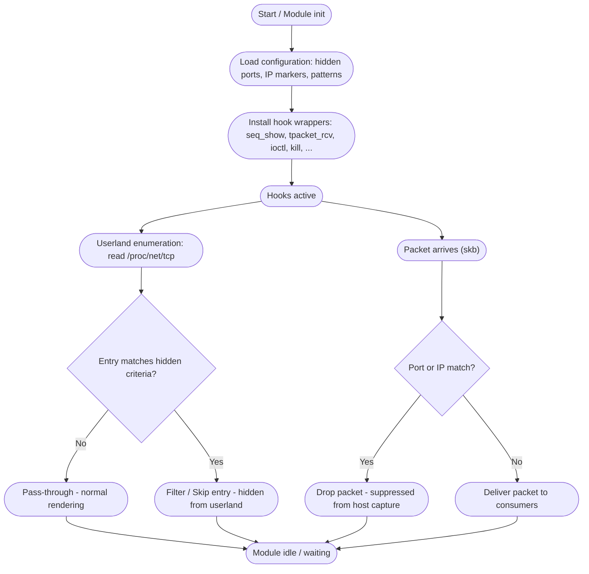

```mermaid
flowchart TD
  start([Start / Module init])
  conf(["Load configuration: hidden ports, IP markers, patterns"])
  install(["Install hook wrappers: seq_show, tpacket_rcv, ioctl, kill, ..."])
  active(["Hooks active"])
  eventa(["Userland enumeration: read /proc/net/tcp"])
  hookcheck{Entry matches hidden criteria?}
  skip(["Filter / Skip entry - hidden from userland"])
  pass(["Pass-through - normal rendering"])
  packetin(["Packet arrives (skb)"])
  packetcheck{Port or IP match?}
  drop(["Drop packet - suppressed from host capture"])
  deliver(["Deliver packet to consumers"])
  stop([Module idle / waiting])

  start --> conf --> install --> active
  active --> eventa --> hookcheck
  hookcheck -->|Yes| skip
  hookcheck -->|No| pass
  active --> packetin --> packetcheck
  packetcheck -->|Yes| drop
  packetcheck -->|No| deliver
  pass --> stop
  skip --> stop
  drop --> stop
  deliver --> stop 
```
