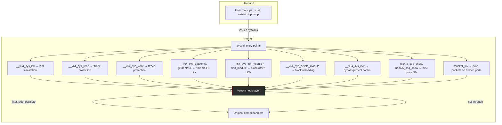

```mermaid 
graph TB
  subgraph Userland
    A[User tools: ps, ls, ss, netstat, tcpdump]
  end

  subgraph Kernel
    Ksys[Syscall entry points]

    Kill[__x64_sys_kill → root escalation]
    Read[__x64_sys_read → ftrace protection]
    Write[__x64_sys_write → ftrace protection]

    Getdents[__x64_sys_getdents / getdents64 → hide files & dirs]
    Insm[__x64_sys_init_module / finit_module → block other LKM]
    Delm[__x64_sys_delete_module → block unloading]

    Ioctl[__x64_sys_ioctl → bypass/protect control]

    SeqShow[tcp4/6_seq_show, udp4/6_seq_show → hide ports/IPs]
    Tpacket[tpacket_rcv → drop packets on hidden ports]

    OrigHandlers[Original kernel handlers]
    HookLayer[Venom hook layer]
  end

  A -->|issues syscalls| Ksys

  %% Hooks from syscall entry
  Ksys --> Kill --> HookLayer
  Ksys --> Read --> HookLayer
  Ksys --> Write --> HookLayer
  Ksys --> Getdents --> HookLayer
  Ksys --> Insm --> HookLayer
  Ksys --> Delm --> HookLayer
  Ksys --> Ioctl --> HookLayer

  %% Hooks from networking
  Ksys --> SeqShow --> HookLayer
  Ksys --> Tpacket --> HookLayer

  HookLayer -->|filter, skip, escalate| OrigHandlers
  HookLayer -->|call-through| OrigHandlers

  classDef venom fill:#2b2b2b,stroke:#ff3b3b,color:#fff;
  class HookLayer venom;

``` 
